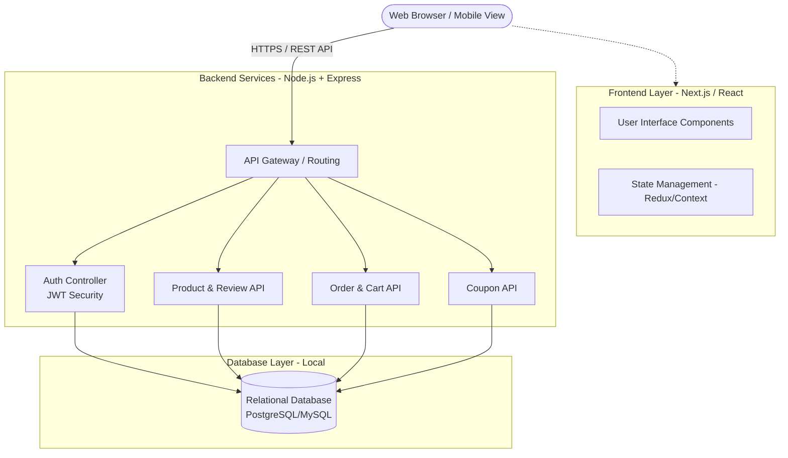
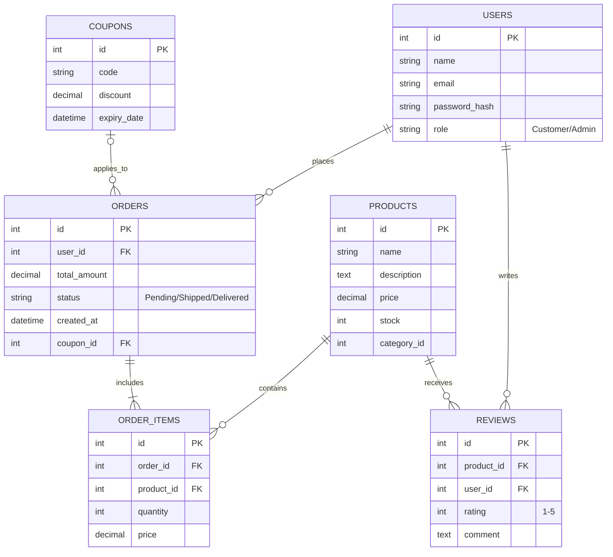
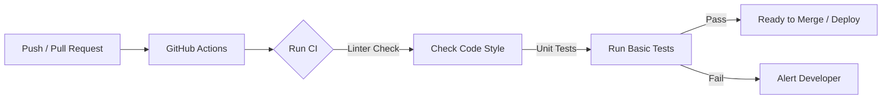

# OmniCart - E-Commerce Platform

**System Analysis & Design Specification (SADS)**

*เอกสารฉบับนี้จัดทำขึ้นเพื่อใช้ประกอบโปรเจกต์ในรายวิชา DIGITAL PLATFORM FOR SOFTWARE DEVELOPMENT*

---

## สารบัญ (Table of Contents)

1. [ภาพรวมโครงการและวัตถุประสงค์ (Executive Summary)](#1-ภาพรวมโครงการและวัตถุประสงค์-executive-summary)
2. [ขอบเขตและเป้าหมายทางธุรกิจ (Project Scope & Business Goals)](#2-ขอบเขตและเป้าหมายทางธุรกิจ-project-scope--business-goals)
3. [สถาปัตยกรรมของระบบ (System Architecture Design)](#3-สถาปัตยกรรมของระบบ-system-architecture-design)
4. [ความต้องการเชิงฟังก์ชัน (Functional Requirements)](#4-ความต้องการเชิงฟังก์ชัน-functional-requirements)
5. [ความต้องการเชิงคุณลักษณะ (Non-Functional Requirements)](#5-ความต้องการเชิงคุณลักษณะ-non-functional-requirements)
6. [การออกแบบโครงสร้างข้อมูล (Database & Data Model)](#6-การออกแบบโครงสร้างข้อมูล-database--data-model)
7. [แนวทางการทำงานร่วมกัน (Team Collaboration & Version Control)](#7-แนวทางการทำงานร่วมกัน-team-collaboration--version-control)
8. [กระบวนการส่งมอบซอฟต์แวร์ (CI/CD & DevOps Pipeline)](#8-กระบวนการส่งมอบซอฟต์แวร์-cicd--devops-pipeline)
9. [แผนการดำเนินงาน (Project Timeline & Milestones)](#9-แผนการดำเนินงาน-project-timeline--milestones)
10. [การจัดการความเสี่ยง (Risk Management)](#10-การจัดการความเสี่ยง-risk-management)

---

## 1. ภาพรวมโครงการและวัตถุประสงค์ (Executive Summary)

**OmniCart** เป็นแพลตฟอร์มพาณิชย์อิเล็กทรอนิกส์ (E-Commerce Platform) แบบครบวงจร ที่มุ่งเน้นการมอบประสบการณ์การซื้อขายที่รวดเร็ว ปลอดภัย และใช้งานง่าย โดยครอบคลุมตั้งแต่กระบวนการค้นหาสินค้าไปจนถึงการชำระเงินและติดตามสถานะการจัดส่ง 

**วัตถุประสงค์:**

- เพื่อพัฒนาระบบร้านค้าออนไลน์ที่รองรับการใช้งานที่ครอบคลุมการซื้อขายจริง
- เพื่อศึกษาและประยุกต์ใช้เทคโนโลยีสมัยใหม่ในการพัฒนาซอฟต์แวร์ ได้แก่ Frontend (Next.js/React), Backend (Node.js/Express) และฐานข้อมูล Relational Database
- เพื่อเรียนรู้กระบวนการทำงานเป็นทีมด้วย Git และระบบ CI/CD (GitHub Actions)

## 2. ขอบเขตและเป้าหมายทางธุรกิจ (Project Scope & Business Goals)

### 2.1 เป้าหมาย (Business Goals)

1. อำนวยความสะดวกให้ลูกค้าสามารถสั่งซื้อสินค้าได้ตลอด 24 ชั่วโมง พร้อมระบบติดตามสถานะ
2. มีระบบจัดการหลังบ้าน (Back-Office) ที่ช่วยให้ผู้ดูแลระบบควบคุมสินค้าและคำสั่งซื้อได้ง่าย
3. นำเสนอระบบรีวิวสินค้าและคูปองส่วนลดเพื่อกระตุ้นยอดขาย

### 2.2 ขอบเขตระบบ (System Boundaries)

- **ผู้ใช้งานทั่วไป/ลูกค้า (Customer):** ค้นหาสินค้า, กรองสินค้า, เพิ่มลงตะกร้า, ชำระเงิน, ติดตามสถานะ, รีวิวสินค้า และใช้คูปองส่วนลด
- **ผู้ดูแลระบบ (Admin):** จัดการข้อมูลสินค้า, จัดการหมวดหมู่, จัดการสถานะคำสั่งซื้อ, และสร้างคูปองส่วนลด

## 3. สถาปัตยกรรมของระบบ (System Architecture Design)

ระบบใช้สถาปัตยกรรมแบบ **Client-Server Architecture** โดยแยกส่วน Frontend และ Backend เพื่อให้ง่ายต่อการดูแลและพัฒนาต่อยอด (Separation of Concerns)

## 4. ความต้องการเชิงฟังก์ชัน (Functional Requirements)

ความต้องการเชิงฟังก์ชันที่ระบบสามารถทำได้ แบ่งออกเป็น 2 ส่วนหลักๆ ดังนี้:

### 4.1 ระบบหน้าเว็บสำหรับลูกค้า (Customer Frontend)

| รหัส | ฟังก์ชัน | รายละเอียด | ความสำคัญ |
| :--- | :--- | :--- | :--- |
| **C-01** | การจัดการบัญชี | สมัครสมาชิก, เข้าสู่ระบบ, ออกจากระบบ, แก้ไขข้อมูลส่วนตัว | High |
| **C-02** | การเลือกซื้อสินค้า | ค้นหาสินค้าจากชื่อ (Search), กรองสินค้าตามหมวดหมู่ (Filter) | High |
| **C-03** | ระบบตะกร้าสินค้า | เพิ่มสินค้าลงตะกร้า, ลด/เพิ่มจำนวน, ลบสินค้า, คำนวณราคารวมอัตโนมัติ | High |
| **C-04** | ระบบสั่งซื้อ | กรอกที่อยู่จัดส่ง, ยืนยันคำสั่งซื้อ (Checkout Process) | High |
| **C-05** | ระบบหลังการขาย | ดูประวัติการสั่งซื้อย้อนหลัง, ติดตามสถานะคำสั่งซื้อ (Order Tracking) | Medium |
| **C-06** | ระบบเสริม | สามารถใช้คูปองส่วนลด (Coupon) และรีวิวให้คะแนนสินค้าได้ (Review & Rating) | Medium |

### 4.2 ระบบหลังบ้าน (Admin Dashboard)

| รหัส | ฟังก์ชัน | รายละเอียด | ความสำคัญ |
| :--- | :--- | :--- | :--- |
| **A-01** | การจัดการสินค้า | เพิ่มสินค้าใหม่, แก้ไขข้อมูล (รูปภาพ/ราคา/รายละเอียด), ลบสินค้า, ตัดสต๊อก | High |
| **A-02** | การจัดการคำสั่งซื้อ | ดูรายการสั่งซื้อทั้งหมด และอัปเดตสถานะ (รอดำเนินการ -> กำลังจัดส่ง -> สำเร็จ) | High |
| **A-03** | การจัดการโปรโมชั่น | สร้างโค้ดส่วนลด (Coupon Code), กำหนดมูลค่าที่ลด, กำหนดวันหมดอายุ | Medium |

## 5. ความต้องการเชิงคุณลักษณะ (Non-Functional Requirements)

- **Performance:** หน้าเว็บควรโหลดได้อย่างรวดเร็ว ไม่กระตุก และ API มีความเร็วในการตอบสนอง
- **Security:** 
  - รหัสผ่านของผู้ใช้ต้องถูกเข้ารหัส (Hashing) ก่อนบันทึกลง Database
  - มีการยืนยันตัวตนการเข้าถึง API ด้วย JWT (JSON Web Token)
  - Admin เท่านั้นที่สามารถเข้าถึง Endpoint ของระบบหลังบ้านได้
- **Usability:** รูปแบบ UI/UX ใช้งานง่าย สะอาดตา และเป็น Responsive Design รองรับการแสดงผลบนหน้าจอมือถือ
- **Availability:** ทำงานบนเครื่อง Local ได้อย่างเสถียร หรือหาก Deploy ต้องทำงานได้ตลอด 24 ชั่วโมง

## 6. การออกแบบโครงสร้างข้อมูล (Database & Data Model)

เพื่อให้เข้าใจความสัมพันธ์ของข้อมูล จึงได้ออกแบบ Entity Relationship (ERD) เบื้องต้น ดังนี้:

## 7. แนวทางการทำงานร่วมกัน (Team Collaboration & Version Control)

ทีมใช้ **Git** และ **GitHub** ในการจัดการ Source Code โดยประยุกต์ใช้หลักการ **Git Flow** เพื่อลดความขัดแย้งของโค้ด:

1. **Branching Strategy:**
   - `main`: เก็บซอร์สโค้ดที่เสถียรที่สุด พร้อมสำหรับการรันนำเสนอ
   - `develop`: กิ่งหลักสำหรับการรวมงานใหม่ๆ ที่กำลังพัฒนา
   - `feature/*`: สำหรับพัฒนาแต่ละฟีเจอร์แยกกัน เช่น `feature/auth`, `feature/cart`
2. **Commit Convention:**
   - ใช้รูปแบบชัดเจน เช่น `feat: add order tracking`, `fix: resolve cart calculation bug`
3. **Pull Requests (PR):**
   - การนำโค้ดจาก `feature` เข้าสู่ `develop` ต้องทำผ่าน Pull Request 

## 8. กระบวนการส่งมอบซอฟต์แวร์ (CI/CD & DevOps Pipeline)

นำเทคโนโลยี **GitHub Actions** มาใช้ในการสร้าง Pipeline พื้นฐาน:

- **Continuous Integration (CI):** ทุกครั้งที่มีการอัปเดตโค้ด ระบบจะตรวจเช็ค Syntax และรูปแบบโค้ด (Linter) 
- **Database & Environment:** ใช้ Local Database (`.env` configuration) เพื่อความสะดวกรวดเร็วในการพัฒนาระดับการศึกษา

## 9. แผนการดำเนินงาน (Project Timeline & Milestones)

| Milestone | รายละเอียด |
| :--- | :--- |
| **Phase 1: Design** | ออกแบบ UI/UX, System Architecture และ Database (ERD) |
| **Phase 2: Core Dev** | เริ่มสร้าง Project Structure, พัฒนา API Login/Register และหน้าจัดการสินค้า (Admin) |
| **Phase 3: Shopping** | พัฒนาระบบค้นหาสินค้า, ระบบตะกร้า (Cart), และการสั่งซื้อ (Checkout) |
| **Phase 4: Tracking & Extras** | ทำระบบติดตามสถานะ, รีวิวสินค้า, และระบบคูปองส่วนลด |
| **Phase 5: Integration** | รวมโค้ด Frontend/Backend, ตั้งค่า GitHub Actions, ทดสอบการทำงานทั้งหมด |
| **Phase 6: Delivery** | เตรียมสไลด์นำเสนอโปรเจกต์ และเตรียมความพร้อมสำหรับ Demo รันผ่าน Local DB |

## 10. การจัดการความเสี่ยง (Risk Management)

| ความเสี่ยง (Risks) | ผลกระทบ | แผนการจัดการรองรับ (Mitigation Plan) |
| :--- | :---: | :--- |
| **งานเสร็จไม่ทันตามกำหนด (Schedule)** | สูง | ทยอยพัฒนาตามความสำคัญ (Core Features ก่อน) เพื่อให้ระบบหลักทำงานได้ |
| **Merge Conflict รุนแรง** | ปานกลาง | ทีมสื่อสารกันก่อนแก้ไขไฟล์ร่วม (เช่น ไฟล์ `App.js` หรือไฟล์ Database Config) |
| **Local Database ใช้งานบนเครื่องอื่นไม่ได้** | สูง | จัดทำสคริปต์ Database Seeders เพื่อให้เพื่อนร่วมทีมดึงข้อมูลจำลองไปรันได้ทันที |

---

*&copy; 2026 E-Commerce Development Team. Document version 1.0 (Draft)*
